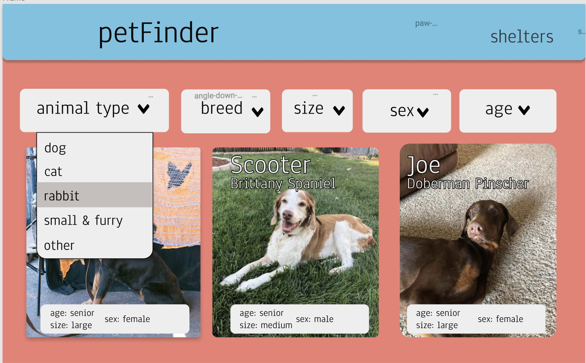
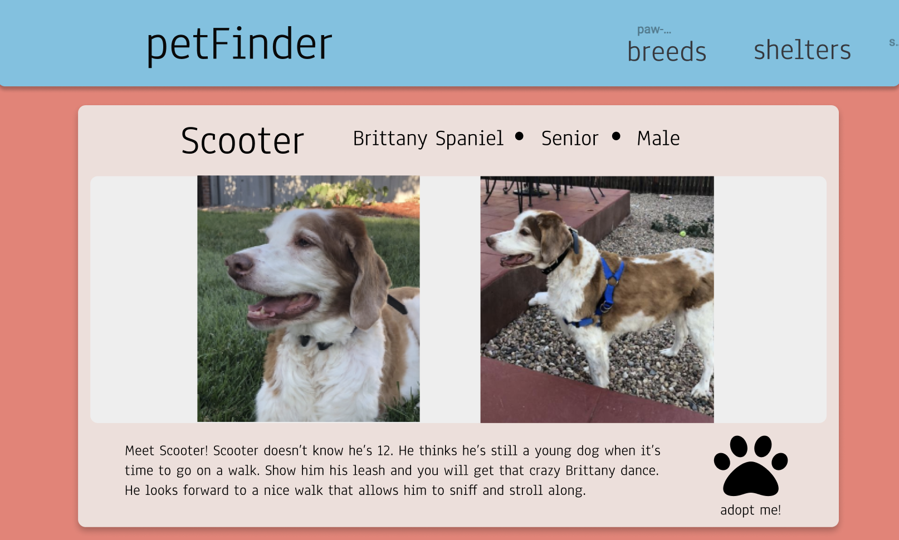
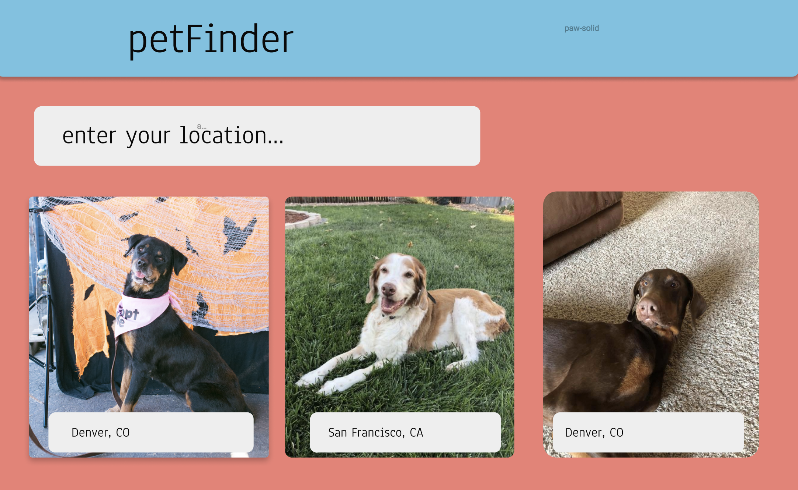
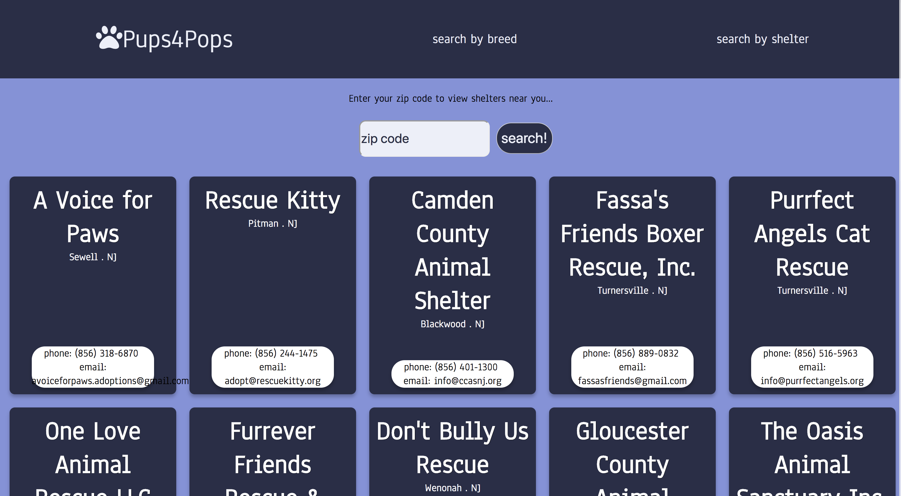

# PET FINDER

### Description of App:
This app was to create an App that serves a random audience using an API. My App is meant to serve an audience of elderly adults, using the Pet Finder API.  Users can come to this application and find a companion pet; and have the ability to search by breed or search by shelters using their location.

### Technologies used:
* React
* Redux
* React Router
* Redux-Thunk Middleware
* Jest
* Enzyme

### Setup:
This project was bootstrapped with [Create React App](https://github.com/facebook/create-react-app).

* `git clone https://github.com/colev1/movie-tracker`
* `cd movie-tracker/`
* `npm install`
* `npm start`

Open [http://localhost:3000](http://localhost:3000) to view it in the browser.

### Testing
In the movie-tracker directory, you can run the test files using:
`npm test`

### Design and Layout

##### Wireframe:

##### The App:

